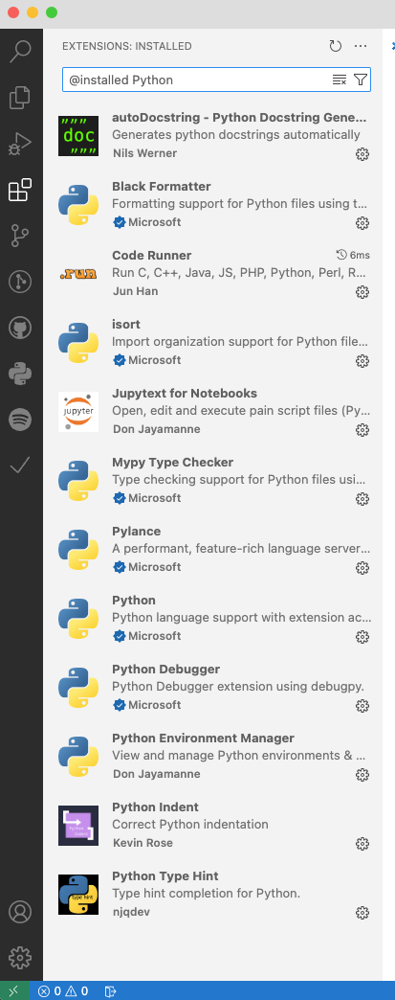
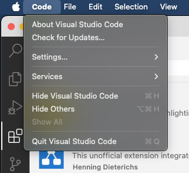
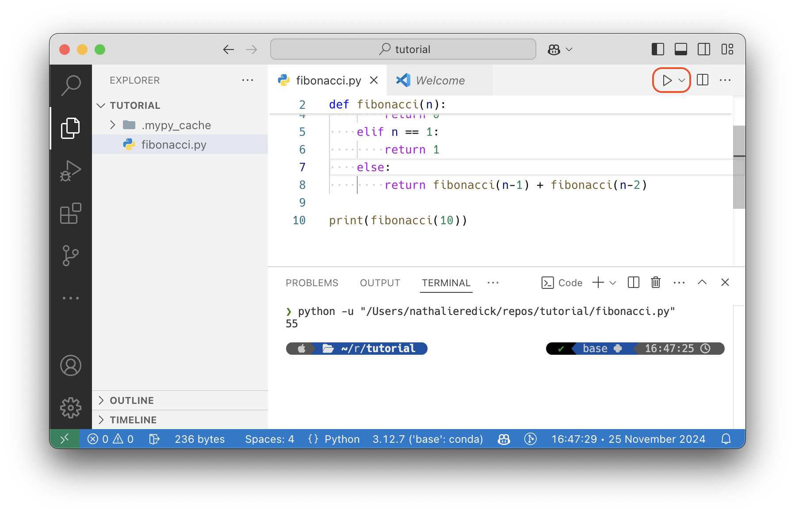
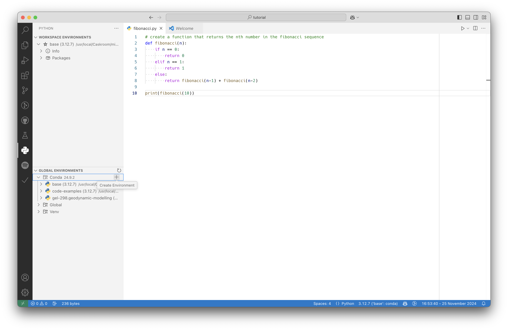
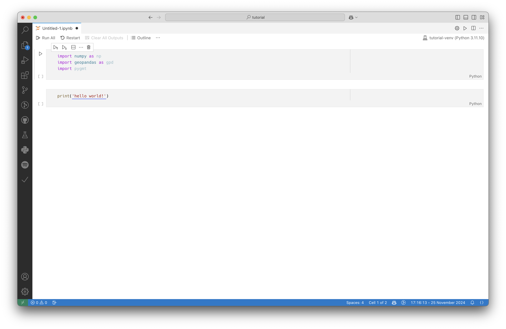

## Installations

<!-- ### What is `Homebrew`?

We will use `Homebrew` to install both Python and Visual Studio Code.

The easiest and most consistent way to install Python (and other software & apps) on a Mac is using the [Homebrew](https://brew.sh) package manager---a way to manage software and apps from the command line . You can browse all available apps (Brew calls them *casks*) online at [formulae.brew.sh](https://formulae.brew.sh).

To install `Homebrew`, open `Terminal.app` on your Mac and paste in the following command:

``` sh
/bin/bash -c "$(curl -fsSL https://raw.githubusercontent.com/Homebrew/install/HEAD/install.sh)"
```


> Leave the terminal open for the next few steps! -->

### Installing Python

<!-- We will use `Homebrew` to install a Python **distribution** as well. -->

We will download our Python **distribution** from the [Miniconda website](https://docs.conda.io/en/latest/miniconda.html). Click on the link for the MacOS (Apple Silicon) installer and download the file.

> A distribution of a language is a bundle that contains an implementation of Python along with a bunch of libraries or tools.

We will use the Miniconda Python distribution, which is provided by Anaconda. You can read more about it [here](https://docs.anaconda.com/miniconda/) (later). Simply, it contains the Python language, a **package manager** called `conda`, all of the packages they both depend on, and a small number of other useful packages.

Miniconda is a good distribution because:

- It is relatively light-weight, so it won't take up a lot of stuff on your computer
- It contains `conda`, which is very good at installing python packages (like `numpy`, `pygmt`) and for managing **virtual environments** (which we'll talk about later)

<!-- We will use `Homebrew` to install Miniconda, so enter the following command in the terminal:

``` sh
brew install --cask miniconda
```

 -->


Once you have downloaded the installer, open it and follow the instructions. You will need to agree to the license, select the installation location, and then install the software. You do not need to make any changes to the installation options.

<!-- #### Make sure your computer can find & run the Python distribution

Once we have Miniconda installed, we have to make sure the apps on our computer know where to find it. Depending on whether your terminal says `zsh` or `bash` (this is the type of **shell** you are using) at the beginning of the line, you will have to put it in a different place. If you're unsure, you can run both commands! *However*, most modern Macs use `zsh` by default.

##### For `zsh`

First, run the following command to add Python to your path so apps on your Mac knows where to find it:

``` sh
echo "PATH=/opt/homebrew/Caskroom/miniconda:$PATH" >> ~/.zshrc
```

Then, we want to make sure `conda` always starts up when we open a new terminal window---called a **shell**:

``` sh
echo 'eval "$(conda "shell.$(basename "${SHELL}")" hook)"' >> ~/.zprofile
```

##### For `bash`

First, run the following command to add Python to your path so apps on your Mac knows where to find it:

``` sh
echo "PATH=/opt/homebrew/Caskroom/miniconda:$PATH" >> ~/.bashrc
```

Then, we want to make sure `conda` always starts up when we open a new terminal window---called a **shell**:

``` sh
echo 'eval "$(conda "shell.$(basename "${SHELL}")" hook)"' >> ~/.bash_profile
```
-->

### Installing Visual Studio Code

Now that we have a Python distribution installed, we need somewhere we can read, write, and run code!

Visual Studio Code (VSCode, VSC) is one of *the most popular* ways to write code, not just Python! It is a light-weight **code editor** ([What's the difference between a code editor and an IDE?](#whats-the-difference-between-a-code-editor-and-an-ide)).

<!-- We will use `Homebrew` to install VSCode also! Like before, enter the following command in your terminal:

``` sh
brew install --cask visual-studio-code
```

 -->

You can find the download link & some helpful instructions for VSC here: [https://code.visualstudio.com/docs/setup/mac](https://code.visualstudio.com/docs/setup/mac)

Once you have downloaded VSC, open it and follow any instructions that pop up. Then, open the app!

#### What's the difference between a code editor and an IDE?

> "IDE" stands for "Integrated Development Environment" is a fully-featured place to develop code. They have built-in debuggers, syntax highlighting, etc.

Popular IDEs for Python are PyCharm and Spyder. However, they take up a lot of space and frequently only work to code in one language.

On the other hand, a code editor is very light-weight an easy to modify. They typically also work for many languages. VSC is a code editor that is built on the idea of **extensions**. You can add extensions to modify the way VSC works---almost anything you can think of.

Importantly, VSCode is free, and so are its extensions. While there are free versions of IDEs, some of the features are behind paywalls.

## Setting up your coding environment

### Adding Python-relevant extensions to VSC

To be able to read, write, and run Python, we will need to install some extensions.

First, open up VSC. It will look something like this:


Then, we want to open up the **"extensions"** panel and install the extensions you see in the image below:



Now, we want to ensure that VSC knows where to find our Miniconda Python executable. To do so, open up settings (the easiest way to do so is `cmd + ,`), or the top navigation bar that says: "Code" > "Settings..."



Then, we add `~/miniconda3/bin/python` to the following setting:

<!--  -->


We also want to tell the Code Runner extension to use the Python interpreter from our Miniconda distribution. To do so, we need to add the following line to our VSC settings:

``` json
"code-runner.executorMap": {
    "python": "python $fullFileName",
}
```

You can find this setting by searching for `code-runner.executorMap` in the settings search bar (open settings with `cmd + ,`), then clicking the link to edit in `settings.json`.


Then, make sure VSC will use your terminal for outputs. You can do this by searching for `code-runner.runInTerminal` in the settings search bar and making sure it is set to `true`.

### Running your first Python file

Now, it is time to see if everything is working. First, let's create a new Python file and name it `fibonacci.py`:


Let's create a function that returns the *nth* value in the Fibonacci sequence.

``` python
# create a function that returns the nth number in the fibonacci sequence
def fibonacci(n):
    if n == 0:
        return 0
    elif n == 1:
        return 1
    else:
        return fibonacci(n-1) + fibonacci(n-2)

print(fibonacci(10))
```


Then, we need to set the **interpreter** (AKA, what python environment are you using?). You may see this option in the bottom bar (blue in the image above). Alternatively, you can access it from the **command palette** using the keyboard shortcut `cmd + shift + p`. For now, we want to use our `conda` *base* environment. It does not matter if the Python version is the same as shown in the photo below.


Now, we can use the button in the top right corner to run the file. This will open a terminal shell within VSC that outputs the result of the code we wrote.



### Python virtual environments

In the last example, we used our `conda` *base* environment to run the code. However, we ***never*** want to install packages in our base environment. If we accidentally mess up the base, it can cause a lot of (very frustrating issues). So, we use **virtual environments**.

> A virtual environment (venv) is an isolated version of Python you can install packages into without effecting your base environment or any other venvs that you create. Typically, we create new venvs for each project we work on.

`conda` can help us manage virtual environments.

First, we want to open one of the extensions we installed (*donjayamanne.python-environment-manager*):



Then, under global environments, under `conda`, we will use the `+` to create a new globally-accessible Python environment.

A window will pop up asking you to select the version of Python you want the environment to use, typically you would select the newest version.


Then, you will be asked to give the environment a name:


A window will ask you if you want to use this environment in the current workspace, you should say yes. This sets your interpreter to the new environment we created.


In our global environments pane, we can now see the environment we created. Now, we want to install packages that we want to use. To do so, you will need to open a terminal shell with the venv *activated*. Our package manager extension can do this for us:


This will run the command to activate the environment for you and an **integrated terminal** (one that is inside of our code editor) will pop up.


Now we can run `conda` commands. We want to install a few different libraries:

- `numpy`
- `pygmt`
- `geopandas`
- `obspy`

We can do this with the following command in our integrated terminal window:

``` sh
conda install numpy pygmt geopandas obspy -y
```

The command may take several seconds to run, especially when you are installing several libraries at once.

> `-y` tells the command to confirm any prompts confirming the libraries. If you want to answer prompts manually, you can leave this message off.

You will see this output if the installs are successful:


If you want to check which packages are in your venv, you can run `conda list`. This will include ***a lot*** of libraries you don't remember installing. These are called **dependencies**, they are packages that the libraries you asked `conda` to install need to be able to run properly. If you want to search for specific libraries in the list, you can use this command: `conda list | grep <name of package>`


> The other columns are the **version** of `pygmt`, the **build**, and the **channel** of `conda` we installed it from.

### Running your first Jupyter Notebook

Now that we have a working virtual environment, we can start working within our venv in a Jupyter Notebook (any file with a `*.ipynb` extension).

First, use the command palette (`cmd + shift + p`) to run the command for creating a new notebook. The command palette will search as you type.


Now, we have an empty notebook file. First, we need to tell the notebook what Python venv to use when running code. Notebooks call this the **kernel**. You will see a button in the upper right corner for selecting the kernel.


We want to select the venv we just installed our packages into:


Now, we can add some code to our cells.



Then, you can use the *run all* button to run all of the cells. You will notice that when you first run your notebook with a new environment, you will be asked to install the `ipykernel` library. This is what your venv needs to interpret and run cells, so let it install the library.


Then, your code will run!


## Pro-tips

### Using the command palette

In VSC, the command palette is your best friend. Becoming comfortable with the `cmd + shift + p` keyboard shortcut will make development much easier.

The command palette will search as you type, allowing you to find and use the commands provided by both VSC natively and all of the extensions you have installed.

### Accessing (and hiding) the integrated terminal

Sometimes, you want to hide (or show) the integrated terminal window. It have be helpful to minimize it to maximize editor space. For showing or hiding the terminal (without ending the shell session), you can use `cmd + j`.

### Exploring settings

You will want to take some time to explore the settings of VSC and the extensions you have installed. It may be overwhelming at first, but it will give you a better idea of what VSC and your extensions can do.

Some useful things to look for may be:

- turning on autosave
- turning on auto-closing brackets such as (), {}, \[\]
- changing the default font & font size
- changing the theme!!


### Other useful extensions

VSC has ***infinitely*** many useful extensions. Take some time to search in the extensions pane for things that might be useful. I have included ones I use all the time below.


### Learning your other keyboard shortcuts

There are so many useful shortcuts that will make it possible & easier to do useful things. There are lots of "cheat sheets" online that explain what these are.
