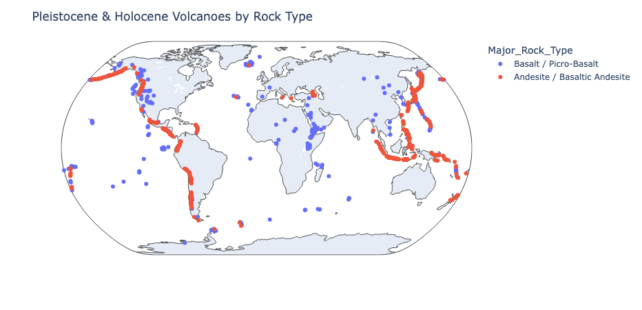

<style>
  /* Make the table container scrollable both horizontally and vertically */
  .table-container {
    width: 100%;             /* Full width of the parent container */
    max-width: 100%;         /* Ensure it does not exceed the page width */
    overflow-x: auto;        /* Enable horizontal scrolling */
    overflow-y: auto;        /* Enable vertical scrolling */
    max-height: 400px;       /* Optional: set a fixed height for the container */
    margin: 0 auto;          /* Center the table container */
    display: block;          /* Ensure the table is treated as a block element for scrolling */
    /* box-sizing: border-box;  Include padding in width calculations */
  }

  /* Table styles */
  .dataframe {
    width: 100%;              /* Table width as 100% of container */
    min-width: 100%;           /* Ensures the table occupies the full container width */
    border-collapse: collapse;/* Remove double borders */
    table-layout: auto;       /* Allow columns to adjust based on content */
    word-wrap: break-word;    /* Ensure long words break inside the cells */
  }

  /* Table header and cell styles */
  .dataframe th, .dataframe td {
    padding: 2px;             Padding inside cells
    text-align: center;         /* Align text to the left */
    border: 1px solid #ddd;  /* Light gray border */
    word-wrap: break-word;    /* Break words inside cells */
    white-space: normal;      /* Ensure text doesn't overflow */
    vertical-align: middle;   /* Align text vertically */
    overflow: hidden;         /* Hide overflow content */
    text-overflow: ellipsis;  /* Show ellipsis for overflowing text */
    font-size: 10px;
  }

  /* Styling the header */
  .dataframe th {
    /* background-color: #f4f4f4; Light gray background for header */
    text-align: center;         /* Center align header text */
  }

  /* Optional: Add minimum column width to prevent squashing */
  .dataframe td {
    min-width: 150px; /* Prevent columns from becoming too narrow */
    max-width: 300px; /* Optionally limit column width */
  }
</style>


```python
import pandas as pd
import geopandas as gpd
import plotly.express as px
import seaborn as sns
import matplotlib.pyplot as plt

from sklearn.ensemble import GradientBoostingClassifier
from sklearn.pipeline import Pipeline
from sklearn.preprocessing import OneHotEncoder, StandardScaler, LabelEncoder
from sklearn.compose import ColumnTransformer
from sklearn.model_selection import train_test_split
from sklearn.metrics import accuracy_score, log_loss, confusion_matrix

```

## Data Preprocessing

- Data cleaning
- Data transformation
- Feature selection
- Data normalization/standardization & encoding
- Train/test split

### Download volcano data from GVP

Holocene & Pleistocene volcanoes from the Smithsonian Global Volcanism Program (GVP) databases.

https://volcano.si.edu/database/webservices.cfm

```python
# request data from Smithsonian database
server = 'https://webservices.volcano.si.edu/geoserver/GVP-VOTW/ows?'
queries = {
    'holocene': 'service=WFS&request=GetFeature&typeName=GVP-VOTW:Smithsonian_VOTW_Holocene_Volcanoes&outputFormat=json',
    'pleistocene': 'service=WFS&request=GetFeature&typeName=GVP-VOTW:Smithsonian_VOTW_Pleistocene_Volcanoes&outputFormat=json'
}

# download data using geopandas
holocene_volcanoes = gpd.read_file(server + queries['holocene'])
pleistocene_volcanoes = gpd.read_file(server + queries['pleistocene'])
```

```python
# combine the two dataframes
volcanoes = gpd.GeoDataFrame(pd.concat([holocene_volcanoes, pleistocene_volcanoes], ignore_index=True))
```

### Data cleaning & transformation

```python
# print the counts of the major rock types
volcanoes['Major_Rock_Type'].value_counts()

volcanoes
```

<div class="table-container">
<table border="1" class="dataframe">
  <thead>
    <tr>
      <th></th>
      <th>id</th>
      <th>Volcano_Number</th>
      <th>Volcano_Name</th>
      <th>Volcanic_Landform</th>
      <th>Primary_Volcano_Type</th>
      <th>Last_Eruption_Year</th>
      <th>Country</th>
      <th>Region</th>
      <th>Subregion</th>
      <th>Geological_Summary</th>
      <th>...</th>
      <th>Longitude</th>
      <th>Elevation</th>
      <th>Tectonic_Setting</th>
      <th>Geologic_Epoch</th>
      <th>Evidence_Category</th>
      <th>Primary_Photo_Link</th>
      <th>Primary_Photo_Caption</th>
      <th>Primary_Photo_Credit</th>
      <th>Major_Rock_Type</th>
      <th>geometry</th>
    </tr>
  </thead>
  <tbody>
    <tr>
      <th>0</th>
      <td>Smithsonian_VOTW_Holocene_Volcanoes.fid--71e2f...</td>
      <td>210010</td>
      <td>West Eifel Volcanic Field</td>
      <td>Cluster</td>
      <td>Volcanic field</td>
      <td>-8300.0</td>
      <td>Germany</td>
      <td>European Volcanic Regions</td>
      <td>Central European Volcanic Province</td>
      <td>The West Eifel Volcanic Field of western Germa...</td>
      <td>...</td>
      <td>6.8500</td>
      <td>600.0</td>
      <td>Rift zone / Continental crust (&gt; 25 km)</td>
      <td>Holocene</td>
      <td>Eruption Dated</td>
      <td>https://volcano.si.edu/gallery/photos/GVP-0150...</td>
      <td>The lake-filled Weinfelder maar is one of abou...</td>
      <td>Photo by Richard Waitt, 1990 (U.S. Geological ...</td>
      <td>Foidite</td>
      <td>POINT (6.85 50.17)</td>
    </tr>
    <tr>
      <th>1</th>
      <td>Smithsonian_VOTW_Holocene_Volcanoes.fid--71e2f...</td>
      <td>210020</td>
      <td>Chaine des Puys</td>
      <td>Cluster</td>
      <td>Lava dome(s)</td>
      <td>-4040.0</td>
      <td>France</td>
      <td>European Volcanic Regions</td>
      <td>Western European Volcanic Province</td>
      <td>The Chaîne des Puys, prominent in the history ...</td>
      <td>...</td>
      <td>2.9810</td>
      <td>1464.0</td>
      <td>Rift zone / Continental crust (&gt; 25 km)</td>
      <td>Holocene</td>
      <td>Eruption Dated</td>
      <td>https://volcano.si.edu/gallery/photos/GVP-0880...</td>
      <td>The central part of the Chaîne des Puys volcan...</td>
      <td>Photo by Ichio Moriya (Kanazawa University).</td>
      <td>Basalt / Picro-Basalt</td>
      <td>POINT (2.981 45.786)</td>
    </tr>
    <tr>
      <th>2</th>
      <td>Smithsonian_VOTW_Holocene_Volcanoes.fid--71e2f...</td>
      <td>210030</td>
      <td>Olot Volcanic Field</td>
      <td>Cluster</td>
      <td>Volcanic field</td>
      <td>NaN</td>
      <td>Spain</td>
      <td>European Volcanic Regions</td>
      <td>Western European Volcanic Province</td>
      <td>The Olot volcanic field (also known as the Gar...</td>
      <td>...</td>
      <td>2.5300</td>
      <td>893.0</td>
      <td>Intraplate / Continental crust (&gt; 25 km)</td>
      <td>Holocene</td>
      <td>Evidence Credible</td>
      <td>https://volcano.si.edu/gallery/photos/GVP-1199...</td>
      <td>The forested Volcà Montolivet scoria cone rise...</td>
      <td>Photo by Puigalder (Wikimedia Commons).</td>
      <td>Trachybasalt / Tephrite Basanite</td>
      <td>POINT (2.53 42.17)</td>
    </tr>
    <tr>
      <th>3</th>
      <td>Smithsonian_VOTW_Holocene_Volcanoes.fid--71e2f...</td>
      <td>210040</td>
      <td>Calatrava Volcanic Field</td>
      <td>Cluster</td>
      <td>Volcanic field</td>
      <td>-3600.0</td>
      <td>Spain</td>
      <td>European Volcanic Regions</td>
      <td>Western European Volcanic Province</td>
      <td>The Calatrava volcanic field lies in central S...</td>
      <td>...</td>
      <td>-4.0200</td>
      <td>1117.0</td>
      <td>Intraplate / Continental crust (&gt; 25 km)</td>
      <td>Holocene</td>
      <td>Eruption Dated</td>
      <td>https://volcano.si.edu/gallery/photos/GVP-1185...</td>
      <td>Columba volcano, the youngest known vent of th...</td>
      <td>Photo by Rafael Becerra Ramírez, 2006 (Univers...</td>
      <td>Basalt / Picro-Basalt</td>
      <td>POINT (-4.02 38.87)</td>
    </tr>
    <tr>
      <th>4</th>
      <td>Smithsonian_VOTW_Holocene_Volcanoes.fid--71e2f...</td>
      <td>211004</td>
      <td>Colli Albani</td>
      <td>Caldera</td>
      <td>Caldera</td>
      <td>NaN</td>
      <td>Italy</td>
      <td>European Volcanic Regions</td>
      <td>Italian Peninsula Volcanic Provinces</td>
      <td>The Colli Albani (Alban Hills) complex immedia...</td>
      <td>...</td>
      <td>12.7251</td>
      <td>949.0</td>
      <td>Subduction zone / Continental crust (&gt; 25 km)</td>
      <td>Holocene</td>
      <td>Evidence Uncertain</td>
      <td>https://volcano.si.edu/gallery/photos/GVP-0881...</td>
      <td>The lake-filled Albano maar is part of the Alb...</td>
      <td>Photo by Ichio Moriya (Kanazawa University).</td>
      <td>Foidite</td>
      <td>POINT (12.7251 41.7569)</td>
    </tr>
    <tr>
      <th>...</th>
      <td>...</td>
      <td>...</td>
      <td>...</td>
      <td>...</td>
      <td>...</td>
      <td>...</td>
      <td>...</td>
      <td>...</td>
      <td>...</td>
      <td>...</td>
      <td>...</td>
      <td>...</td>
      <td>...</td>
      <td>...</td>
      <td>...</td>
      <td>...</td>
      <td>...</td>
      <td>...</td>
      <td>...</td>
      <td>...</td>
      <td>...</td>
    </tr>
    <tr>
      <th>2655</th>
      <td>Smithsonian_VOTW_Pleistocene_Volcanoes.fid--71...</td>
      <td>274080</td>
      <td>Y'Ami-North</td>
      <td>Composite</td>
      <td>Compound</td>
      <td>NaN</td>
      <td>Philippines</td>
      <td>Western Pacific Volcanic Regions</td>
      <td>Taiwan-Luzon Volcanic Arc</td>
      <td>Submarine volcanic edifice with the islands of...</td>
      <td>...</td>
      <td>121.9420</td>
      <td>213.0</td>
      <td>NaN</td>
      <td>Pleistocene</td>
      <td>NaN</td>
      <td>NaN</td>
      <td>NaN</td>
      <td>NaN</td>
      <td>NaN</td>
      <td>POINT (121.942 21.0868)</td>
    </tr>
    <tr>
      <th>2656</th>
      <td>Smithsonian_VOTW_Pleistocene_Volcanoes.fid--71...</td>
      <td>274085</td>
      <td>Hsiaolanyu</td>
      <td>Composite</td>
      <td>Compound</td>
      <td>NaN</td>
      <td>Taiwan</td>
      <td>Western Pacific Volcanic Regions</td>
      <td>Taiwan-Luzon Volcanic Arc</td>
      <td>None</td>
      <td>...</td>
      <td>121.6123</td>
      <td>148.0</td>
      <td>NaN</td>
      <td>Pleistocene</td>
      <td>NaN</td>
      <td>NaN</td>
      <td>NaN</td>
      <td>NaN</td>
      <td>NaN</td>
      <td>POINT (121.6123 21.9529)</td>
    </tr>
    <tr>
      <th>2657</th>
      <td>Smithsonian_VOTW_Pleistocene_Volcanoes.fid--71...</td>
      <td>274090</td>
      <td>Lutao</td>
      <td>Composite</td>
      <td>Compound</td>
      <td>NaN</td>
      <td>Taiwan</td>
      <td>Western Pacific Volcanic Regions</td>
      <td>Taiwan-Luzon Volcanic Arc</td>
      <td>None</td>
      <td>...</td>
      <td>121.4927</td>
      <td>268.0</td>
      <td>NaN</td>
      <td>Pleistocene</td>
      <td>NaN</td>
      <td>NaN</td>
      <td>NaN</td>
      <td>NaN</td>
      <td>NaN</td>
      <td>POINT (121.4927 22.658)</td>
    </tr>
    <tr>
      <th>2658</th>
      <td>Smithsonian_VOTW_Pleistocene_Volcanoes.fid--71...</td>
      <td>315055</td>
      <td>Addington Volcanic Field</td>
      <td>Cluster</td>
      <td>Volcanic field</td>
      <td>NaN</td>
      <td>United States</td>
      <td>North America Volcanic Regions</td>
      <td>Queen Charlotte Volcano Group</td>
      <td>The submarine Addington Volcanic Field is abou...</td>
      <td>...</td>
      <td>-134.1700</td>
      <td>-74.0</td>
      <td>NaN</td>
      <td>Pleistocene</td>
      <td>NaN</td>
      <td>NaN</td>
      <td>NaN</td>
      <td>NaN</td>
      <td>NaN</td>
      <td>POINT (-134.17 55.44)</td>
    </tr>
    <tr>
      <th>2659</th>
      <td>Smithsonian_VOTW_Pleistocene_Volcanoes.fid--71...</td>
      <td>315100</td>
      <td>Maclaren River Volcanic Field</td>
      <td>Minor</td>
      <td>Volcanic field</td>
      <td>NaN</td>
      <td>United States</td>
      <td>North America Volcanic Regions</td>
      <td>Northern Cordilleran Volcanic Province</td>
      <td>As described by the Alaska Volcano Observatory...</td>
      <td>...</td>
      <td>-146.3200</td>
      <td>1470.0</td>
      <td>NaN</td>
      <td>Pleistocene</td>
      <td>NaN</td>
      <td>NaN</td>
      <td>NaN</td>
      <td>NaN</td>
      <td>NaN</td>
      <td>POINT (-146.32 63.1369)</td>
    </tr>
  </tbody>
</table>
<p>2660 rows × 21 columns</p>
</div>

### Feature selection

```python
# filter for only andesite, basalt
volcanoes = volcanoes[volcanoes['Major_Rock_Type'].isin(['Andesite / Basaltic Andesite', 'Basalt / Picro-Basalt'])]

# select just the feature cols of interest
volcanoes = volcanoes[['Major_Rock_Type', 'Tectonic_Setting', 'Primary_Volcano_Type', 'Latitude', 'Longitude', 'Volcanic_Landform']]

# drop any that have missing data in the rows
volcanoes.dropna(inplace=True)

# view dataframe
volcanoes
```

<div class="table-container">
<table border="1" class="dataframe">
  <thead>
    <tr>
      <th></th>
      <th>Major_Rock_Type</th>
      <th>Tectonic_Setting</th>
      <th>Primary_Volcano_Type</th>
      <th>Latitude</th>
      <th>Longitude</th>
      <th>Volcanic_Landform</th>
    </tr>
  </thead>
  <tbody>
    <tr>
      <th>1</th>
      <td>Basalt / Picro-Basalt</td>
      <td>Rift zone / Continental crust (&gt; 25 km)</td>
      <td>Lava dome(s)</td>
      <td>45.7860</td>
      <td>2.9810</td>
      <td>Cluster</td>
    </tr>
    <tr>
      <th>3</th>
      <td>Basalt / Picro-Basalt</td>
      <td>Intraplate / Continental crust (&gt; 25 km)</td>
      <td>Volcanic field</td>
      <td>38.8700</td>
      <td>-4.0200</td>
      <td>Cluster</td>
    </tr>
    <tr>
      <th>9</th>
      <td>Andesite / Basaltic Andesite</td>
      <td>Subduction zone / Continental crust (&gt; 25 km)</td>
      <td>Stratovolcano</td>
      <td>38.6380</td>
      <td>15.0640</td>
      <td>Composite</td>
    </tr>
    <tr>
      <th>16</th>
      <td>Andesite / Basaltic Andesite</td>
      <td>Subduction zone / Continental crust (&gt; 25 km)</td>
      <td>Lava dome(s)</td>
      <td>37.6186</td>
      <td>23.3331</td>
      <td>Minor (Basaltic)</td>
    </tr>
    <tr>
      <th>22</th>
      <td>Basalt / Picro-Basalt</td>
      <td>Intraplate / Continental crust (&gt; 25 km)</td>
      <td>Shield</td>
      <td>37.6700</td>
      <td>39.8300</td>
      <td>Shield</td>
    </tr>
    <tr>
      <th>...</th>
      <td>...</td>
      <td>...</td>
      <td>...</td>
      <td>...</td>
      <td>...</td>
      <td>...</td>
    </tr>
    <tr>
      <th>1252</th>
      <td>Basalt / Picro-Basalt</td>
      <td>Subduction zone / Oceanic crust (&lt; 15 km)</td>
      <td>Stratovolcano</td>
      <td>-56.7120</td>
      <td>-27.1760</td>
      <td>Composite</td>
    </tr>
    <tr>
      <th>1253</th>
      <td>Andesite / Basaltic Andesite</td>
      <td>Subduction zone / Oceanic crust (&lt; 15 km)</td>
      <td>Stratovolcano</td>
      <td>-56.6560</td>
      <td>-28.1400</td>
      <td>Composite</td>
    </tr>
    <tr>
      <th>1254</th>
      <td>Basalt / Picro-Basalt</td>
      <td>Subduction zone / Oceanic crust (&lt; 15 km)</td>
      <td>Stratovolcano</td>
      <td>-56.3000</td>
      <td>-27.5700</td>
      <td>Composite</td>
    </tr>
    <tr>
      <th>1257</th>
      <td>Basalt / Picro-Basalt</td>
      <td>Intraplate / Continental crust (&gt; 25 km)</td>
      <td>Shield</td>
      <td>-64.1500</td>
      <td>-57.7500</td>
      <td>Shield</td>
    </tr>
    <tr>
      <th>1268</th>
      <td>Basalt / Picro-Basalt</td>
      <td>Subduction zone / Continental crust (&gt; 25 km)</td>
      <td>Volcanic field</td>
      <td>-45.2200</td>
      <td>-73.0500</td>
      <td>Cluster</td>
    </tr>
  </tbody>
</table>
<p>933 rows × 6 columns</p>
</div>

### Data visualization

```python
# plot volcanoes on map with plotly
fig = px.scatter_geo(volcanoes, lat='Latitude', lon='Longitude', hover_name='Major_Rock_Type', color='Major_Rock_Type')
fig.update_geos(projection_type='natural earth')
fig.update_layout(title='Pleistocene & Holocene Volcanoes by Rock Type')
fig.show()
```

<!-- <iframe src="volcanoes.html" width="800" height="600"></iframe> -->



### Data normalization/standardization & encoding

```python
# Preprocess the features and encode the target
preprocessor = ColumnTransformer(
    transformers=[
        ('num', StandardScaler(), ['Latitude', 'Longitude']),
        ('cat', OneHotEncoder(handle_unknown='ignore'),
         ['Tectonic_Setting', 'Volcanic_Landform', 'Primary_Volcano_Type'])
    ])
```

```python
# separate features (X) and target (y)
X = volcanoes[['Latitude', 'Longitude', 'Tectonic_Setting', 'Volcanic_Landform', 'Primary_Volcano_Type']]
y = volcanoes['Major_Rock_Type']

# encode the target variable (Major_Rock_Type)
label_encoder = LabelEncoder()
y_encoded = label_encoder.fit_transform(y)
```

### Train/test split

```python
# use 20% of the data for testing, shuffle to reduce bias
X_train, X_test, y_train, y_test = train_test_split(X, y_encoded, test_size=0.2, shuffle=True)
```

## Model selection

- `preprocessor`: A preprocessing step to transform the data before classification.
- `classifier`: A Gradient Boosting classifier with the following hyperparameters:
    - `n_estimators`: The number of boosting stages to be run (default=100).
    - `verbose`: Controls the verbosity of the output (default=1).
    - validation_fraction: The proportion of training data to set aside as validation set for early stopping (default=0.15).
    - `learning_rate`: The learning rate shrinks the contribution of each tree by `learning_rate` (default=0.075).
    - `min_impurity_decrease`: A node will be split if this split induces a decrease of the impurity greater than or equal to this value (default=0.01).
    - `max_depth`: The maximum depth of the individual regression estimators (default=3).

```python
# create a pipeline with preprocessor and classifier
model = Pipeline(steps=[
    ('preprocessor', preprocessor),
    ('classifier', GradientBoostingClassifier(n_estimators=100, verbose=1, validation_fraction=0.15, learning_rate=0.075, min_impurity_decrease=0.01, max_depth=3))
])
```

## Model training

```python
# fit the model
model.fit(X_train, y_train)
```

          Iter       Train Loss   Remaining Time
             1           1.3147            0.13s
             2           1.2710            0.11s
             3           1.2332            0.10s
             4           1.2006            0.09s
             5           1.1719            0.08s
             6           1.1471            0.08s
             7           1.1225            0.08s
             8           1.1028            0.08s
             9           1.0833            0.07s
            10           1.0657            0.07s
            20           0.9339            0.07s
            30           0.8741            0.06s
            40           0.8296            0.05s
            50           0.8015            0.04s
            60           0.7746            0.03s
            70           0.7547            0.02s
            80           0.7262            0.02s
            90           0.7085            0.01s
           100           0.6926            0.00s

<style>#sk-container-id-7 {
  /* Definition of color scheme common for light and dark mode */
  --sklearn-color-text: #000;
  --sklearn-color-text-muted: #666;
  --sklearn-color-line: gray;
  /* Definition of color scheme for unfitted estimators */
  --sklearn-color-unfitted-level-0: #fff5e6;
  --sklearn-color-unfitted-level-1: #f6e4d2;
  --sklearn-color-unfitted-level-2: #ffe0b3;
  --sklearn-color-unfitted-level-3: chocolate;
  /* Definition of color scheme for fitted estimators */
  --sklearn-color-fitted-level-0: #f0f8ff;
  --sklearn-color-fitted-level-1: #d4ebff;
  --sklearn-color-fitted-level-2: #b3dbfd;
  --sklearn-color-fitted-level-3: cornflowerblue;

  /* Specific color for light theme */
  --sklearn-color-text-on-default-background: var(--sg-text-color, var(--theme-code-foreground, var(--jp-content-font-color1, black)));
  --sklearn-color-background: var(--sg-background-color, var(--theme-background, var(--jp-layout-color0, white)));
  --sklearn-color-border-box: var(--sg-text-color, var(--theme-code-foreground, var(--jp-content-font-color1, black)));
  --sklearn-color-icon: #696969;

  @media (prefers-color-scheme: dark) {
    /* Redefinition of color scheme for dark theme */
    --sklearn-color-text-on-default-background: var(--sg-text-color, var(--theme-code-foreground, var(--jp-content-font-color1, white)));
    --sklearn-color-background: var(--sg-background-color, var(--theme-background, var(--jp-layout-color0, #111)));
    --sklearn-color-border-box: var(--sg-text-color, var(--theme-code-foreground, var(--jp-content-font-color1, white)));
    --sklearn-color-icon: #878787;
  }
}

#sk-container-id-7 {
  color: var(--sklearn-color-text);
}

#sk-container-id-7 pre {
  padding: 0;
}

#sk-container-id-7 input.sk-hidden--visually {
  border: 0;
  clip: rect(1px 1px 1px 1px);
  clip: rect(1px, 1px, 1px, 1px);
  height: 1px;
  margin: -1px;
  overflow: hidden;
  padding: 0;
  position: absolute;
  width: 1px;
}

#sk-container-id-7 div.sk-dashed-wrapped {
  border: 1px dashed var(--sklearn-color-line);
  margin: 0 0.4em 0.5em 0.4em;
  box-sizing: border-box;
  padding-bottom: 0.4em;
  background-color: var(--sklearn-color-background);
}

#sk-container-id-7 div.sk-container {
  /* jupyter's `normalize.less` sets `[hidden] { display: none; }`
     but bootstrap.min.css set `[hidden] { display: none !important; }`
     so we also need the `!important` here to be able to override the
     default hidden behavior on the sphinx rendered scikit-learn.org.
     See: https://github.com/scikit-learn/scikit-learn/issues/21755 */
  display: inline-block !important;
  position: relative;
}

#sk-container-id-7 div.sk-text-repr-fallback {
  display: none;
}

div.sk-parallel-item,
div.sk-serial,
div.sk-item {
  /* draw centered vertical line to link estimators */
  background-image: linear-gradient(var(--sklearn-color-text-on-default-background), var(--sklearn-color-text-on-default-background));
  background-size: 2px 100%;
  background-repeat: no-repeat;
  background-position: center center;
}

/* Parallel-specific style estimator block */

#sk-container-id-7 div.sk-parallel-item::after {
  content: "";
  width: 100%;
  border-bottom: 2px solid var(--sklearn-color-text-on-default-background);
  flex-grow: 1;
}

#sk-container-id-7 div.sk-parallel {
  display: flex;
  align-items: stretch;
  justify-content: center;
  background-color: var(--sklearn-color-background);
  position: relative;
}

#sk-container-id-7 div.sk-parallel-item {
  display: flex;
  flex-direction: column;
}

#sk-container-id-7 div.sk-parallel-item:first-child::after {
  align-self: flex-end;
  width: 50%;
}

#sk-container-id-7 div.sk-parallel-item:last-child::after {
  align-self: flex-start;
  width: 50%;
}

#sk-container-id-7 div.sk-parallel-item:only-child::after {
  width: 0;
}

/* Serial-specific style estimator block */

#sk-container-id-7 div.sk-serial {
  display: flex;
  flex-direction: column;
  align-items: center;
  background-color: var(--sklearn-color-background);
  padding-right: 1em;
  padding-left: 1em;
}

/* Toggleable style: style used for estimator/Pipeline/ColumnTransformer box that is
clickable and can be expanded/collapsed.
- Pipeline and ColumnTransformer use this feature and define the default style
- Estimators will overwrite some part of the style using the `sk-estimator` class
*/

/* Pipeline and ColumnTransformer style (default) */

#sk-container-id-7 div.sk-toggleable {
  /* Default theme specific background. It is overwritten whether we have a
  specific estimator or a Pipeline/ColumnTransformer */
  background-color: var(--sklearn-color-background);
}

/* Toggleable label */
#sk-container-id-7 label.sk-toggleable__label {
  cursor: pointer;
  display: flex;
  width: 100%;
  margin-bottom: 0;
  padding: 0.5em;
  box-sizing: border-box;
  text-align: center;
  align-items: start;
  justify-content: space-between;
  gap: 0.5em;
}

#sk-container-id-7 label.sk-toggleable__label .caption {
  font-size: 0.6rem;
  font-weight: lighter;
  color: var(--sklearn-color-text-muted);
}

#sk-container-id-7 label.sk-toggleable__label-arrow:before {
  /* Arrow on the left of the label */
  content: "▸";
  float: left;
  margin-right: 0.25em;
  color: var(--sklearn-color-icon);
}

#sk-container-id-7 label.sk-toggleable__label-arrow:hover:before {
  color: var(--sklearn-color-text);
}

/* Toggleable content - dropdown */

#sk-container-id-7 div.sk-toggleable__content {
  max-height: 0;
  max-width: 0;
  overflow: hidden;
  text-align: left;
  /* unfitted */
  background-color: var(--sklearn-color-unfitted-level-0);
}

#sk-container-id-7 div.sk-toggleable__content.fitted {
  /* fitted */
  background-color: var(--sklearn-color-fitted-level-0);
}

#sk-container-id-7 div.sk-toggleable__content pre {
  margin: 0.2em;
  border-radius: 0.25em;
  color: var(--sklearn-color-text);
  /* unfitted */
  background-color: var(--sklearn-color-unfitted-level-0);
}

#sk-container-id-7 div.sk-toggleable__content.fitted pre {
  /* unfitted */
  background-color: var(--sklearn-color-fitted-level-0);
}

#sk-container-id-7 input.sk-toggleable__control:checked~div.sk-toggleable__content {
  /* Expand drop-down */
  max-height: 200px;
  max-width: 100%;
  overflow: auto;
}

#sk-container-id-7 input.sk-toggleable__control:checked~label.sk-toggleable__label-arrow:before {
  content: "▾";
}

/* Pipeline/ColumnTransformer-specific style */

#sk-container-id-7 div.sk-label input.sk-toggleable__control:checked~label.sk-toggleable__label {
  color: var(--sklearn-color-text);
  background-color: var(--sklearn-color-unfitted-level-2);
}

#sk-container-id-7 div.sk-label.fitted input.sk-toggleable__control:checked~label.sk-toggleable__label {
  background-color: var(--sklearn-color-fitted-level-2);
}

/* Estimator-specific style */

/* Colorize estimator box */
#sk-container-id-7 div.sk-estimator input.sk-toggleable__control:checked~label.sk-toggleable__label {
  /* unfitted */
  background-color: var(--sklearn-color-unfitted-level-2);
}

#sk-container-id-7 div.sk-estimator.fitted input.sk-toggleable__control:checked~label.sk-toggleable__label {
  /* fitted */
  background-color: var(--sklearn-color-fitted-level-2);
}

#sk-container-id-7 div.sk-label label.sk-toggleable__label,
#sk-container-id-7 div.sk-label label {
  /* The background is the default theme color */
  color: var(--sklearn-color-text-on-default-background);
}

/* On hover, darken the color of the background */
#sk-container-id-7 div.sk-label:hover label.sk-toggleable__label {
  color: var(--sklearn-color-text);
  background-color: var(--sklearn-color-unfitted-level-2);
}

/* Label box, darken color on hover, fitted */
#sk-container-id-7 div.sk-label.fitted:hover label.sk-toggleable__label.fitted {
  color: var(--sklearn-color-text);
  background-color: var(--sklearn-color-fitted-level-2);
}

/* Estimator label */

#sk-container-id-7 div.sk-label label {
  font-family: monospace;
  font-weight: bold;
  display: inline-block;
  line-height: 1.2em;
}

#sk-container-id-7 div.sk-label-container {
  text-align: center;
}

/* Estimator-specific */
#sk-container-id-7 div.sk-estimator {
  font-family: monospace;
  border: 1px dotted var(--sklearn-color-border-box);
  border-radius: 0.25em;
  box-sizing: border-box;
  margin-bottom: 0.5em;
  /* unfitted */
  background-color: var(--sklearn-color-unfitted-level-0);
}

#sk-container-id-7 div.sk-estimator.fitted {
  /* fitted */
  background-color: var(--sklearn-color-fitted-level-0);
}

/* on hover */
#sk-container-id-7 div.sk-estimator:hover {
  /* unfitted */
  background-color: var(--sklearn-color-unfitted-level-2);
}

#sk-container-id-7 div.sk-estimator.fitted:hover {
  /* fitted */
  background-color: var(--sklearn-color-fitted-level-2);
}

/* Specification for estimator info (e.g. "i" and "?") */

/* Common style for "i" and "?" */

.sk-estimator-doc-link,
a:link.sk-estimator-doc-link,
a:visited.sk-estimator-doc-link {
  float: right;
  font-size: smaller;
  line-height: 1em;
  font-family: monospace;
  background-color: var(--sklearn-color-background);
  border-radius: 1em;
  height: 1em;
  width: 1em;
  text-decoration: none !important;
  margin-left: 0.5em;
  text-align: center;
  /* unfitted */
  border: var(--sklearn-color-unfitted-level-1) 1pt solid;
  color: var(--sklearn-color-unfitted-level-1);
}

.sk-estimator-doc-link.fitted,
a:link.sk-estimator-doc-link.fitted,
a:visited.sk-estimator-doc-link.fitted {
  /* fitted */
  border: var(--sklearn-color-fitted-level-1) 1pt solid;
  color: var(--sklearn-color-fitted-level-1);
}

/* On hover */
div.sk-estimator:hover .sk-estimator-doc-link:hover,
.sk-estimator-doc-link:hover,
div.sk-label-container:hover .sk-estimator-doc-link:hover,
.sk-estimator-doc-link:hover {
  /* unfitted */
  background-color: var(--sklearn-color-unfitted-level-3);
  color: var(--sklearn-color-background);
  text-decoration: none;
}

div.sk-estimator.fitted:hover .sk-estimator-doc-link.fitted:hover,
.sk-estimator-doc-link.fitted:hover,
div.sk-label-container:hover .sk-estimator-doc-link.fitted:hover,
.sk-estimator-doc-link.fitted:hover {
  /* fitted */
  background-color: var(--sklearn-color-fitted-level-3);
  color: var(--sklearn-color-background);
  text-decoration: none;
}

/* Span, style for the box shown on hovering the info icon */
.sk-estimator-doc-link span {
  display: none;
  z-index: 9999;
  position: relative;
  font-weight: normal;
  right: .2ex;
  padding: .5ex;
  margin: .5ex;
  width: min-content;
  min-width: 20ex;
  max-width: 50ex;
  color: var(--sklearn-color-text);
  box-shadow: 2pt 2pt 4pt #999;
  /* unfitted */
  background: var(--sklearn-color-unfitted-level-0);
  border: .5pt solid var(--sklearn-color-unfitted-level-3);
}

.sk-estimator-doc-link.fitted span {
  /* fitted */
  background: var(--sklearn-color-fitted-level-0);
  border: var(--sklearn-color-fitted-level-3);
}

.sk-estimator-doc-link:hover span {
  display: block;
}

/* "?"-specific style due to the `<a>` HTML tag */

#sk-container-id-7 a.estimator_doc_link {
  float: right;
  font-size: 1rem;
  line-height: 1em;
  font-family: monospace;
  background-color: var(--sklearn-color-background);
  border-radius: 1rem;
  height: 1rem;
  width: 1rem;
  text-decoration: none;
  /* unfitted */
  color: var(--sklearn-color-unfitted-level-1);
  border: var(--sklearn-color-unfitted-level-1) 1pt solid;
}

#sk-container-id-7 a.estimator_doc_link.fitted {
  /* fitted */
  border: var(--sklearn-color-fitted-level-1) 1pt solid;
  color: var(--sklearn-color-fitted-level-1);
}

/* On hover */
#sk-container-id-7 a.estimator_doc_link:hover {
  /* unfitted */
  background-color: var(--sklearn-color-unfitted-level-3);
  color: var(--sklearn-color-background);
  text-decoration: none;
}

#sk-container-id-7 a.estimator_doc_link.fitted:hover {
  /* fitted */
  background-color: var(--sklearn-color-fitted-level-3);
}
</style><div id="sk-container-id-7" class="sk-top-container"><div class="sk-text-repr-fallback"><pre>Pipeline(steps=[(&#x27;preprocessor&#x27;,
                 ColumnTransformer(transformers=[(&#x27;num&#x27;, StandardScaler(),
                                                  [&#x27;Latitude&#x27;, &#x27;Longitude&#x27;]),
                                                 (&#x27;cat&#x27;,
                                                  OneHotEncoder(handle_unknown=&#x27;ignore&#x27;),
                                                  [&#x27;Tectonic_Setting&#x27;,
                                                   &#x27;Volcanic_Landform&#x27;,
                                                   &#x27;Primary_Volcano_Type&#x27;])])),
                (&#x27;classifier&#x27;,
                 GradientBoostingClassifier(learning_rate=0.075,
                                            min_impurity_decrease=0.01,
                                            validation_fraction=0.15,
                                            verbose=1))])</pre><b>In a Jupyter environment, please rerun this cell to show the HTML representation or trust the notebook. <br />On GitHub, the HTML representation is unable to render, please try loading this page with nbviewer.org.</b></div><div class="sk-container" hidden><div class="sk-item sk-dashed-wrapped"><div class="sk-label-container"><div class="sk-label fitted sk-toggleable"><input class="sk-toggleable__control sk-hidden--visually" id="sk-estimator-id-43" type="checkbox" ><label for="sk-estimator-id-43" class="sk-toggleable__label fitted sk-toggleable__label-arrow"><div><div>Pipeline</div></div><div><a class="sk-estimator-doc-link fitted" rel="noreferrer" target="_blank" href="https://scikit-learn.org/1.6/modules/generated/sklearn.pipeline.Pipeline.html">?<span>Documentation for Pipeline</span></a><span class="sk-estimator-doc-link fitted">i<span>Fitted</span></span></div></label><div class="sk-toggleable__content fitted"><pre>Pipeline(steps=[(&#x27;preprocessor&#x27;,
                 ColumnTransformer(transformers=[(&#x27;num&#x27;, StandardScaler(),
                                                  [&#x27;Latitude&#x27;, &#x27;Longitude&#x27;]),
                                                 (&#x27;cat&#x27;,
                                                  OneHotEncoder(handle_unknown=&#x27;ignore&#x27;),
                                                  [&#x27;Tectonic_Setting&#x27;,
                                                   &#x27;Volcanic_Landform&#x27;,
                                                   &#x27;Primary_Volcano_Type&#x27;])])),
                (&#x27;classifier&#x27;,
                 GradientBoostingClassifier(learning_rate=0.075,
                                            min_impurity_decrease=0.01,
                                            validation_fraction=0.15,
                                            verbose=1))])</pre></div> </div></div><div class="sk-serial"><div class="sk-item sk-dashed-wrapped"><div class="sk-label-container"><div class="sk-label fitted sk-toggleable"><input class="sk-toggleable__control sk-hidden--visually" id="sk-estimator-id-44" type="checkbox" ><label for="sk-estimator-id-44" class="sk-toggleable__label fitted sk-toggleable__label-arrow"><div><div>preprocessor: ColumnTransformer</div></div><div><a class="sk-estimator-doc-link fitted" rel="noreferrer" target="_blank" href="https://scikit-learn.org/1.6/modules/generated/sklearn.compose.ColumnTransformer.html">?<span>Documentation for preprocessor: ColumnTransformer</span></a></div></label><div class="sk-toggleable__content fitted"><pre>ColumnTransformer(transformers=[(&#x27;num&#x27;, StandardScaler(),
                                 [&#x27;Latitude&#x27;, &#x27;Longitude&#x27;]),
                                (&#x27;cat&#x27;, OneHotEncoder(handle_unknown=&#x27;ignore&#x27;),
                                 [&#x27;Tectonic_Setting&#x27;, &#x27;Volcanic_Landform&#x27;,
                                  &#x27;Primary_Volcano_Type&#x27;])])</pre></div> </div></div><div class="sk-parallel"><div class="sk-parallel-item"><div class="sk-item"><div class="sk-label-container"><div class="sk-label fitted sk-toggleable"><input class="sk-toggleable__control sk-hidden--visually" id="sk-estimator-id-45" type="checkbox" ><label for="sk-estimator-id-45" class="sk-toggleable__label fitted sk-toggleable__label-arrow"><div><div>num</div></div></label><div class="sk-toggleable__content fitted"><pre>[&#x27;Latitude&#x27;, &#x27;Longitude&#x27;]</pre></div> </div></div><div class="sk-serial"><div class="sk-item"><div class="sk-estimator fitted sk-toggleable"><input class="sk-toggleable__control sk-hidden--visually" id="sk-estimator-id-46" type="checkbox" ><label for="sk-estimator-id-46" class="sk-toggleable__label fitted sk-toggleable__label-arrow"><div><div>StandardScaler</div></div><div><a class="sk-estimator-doc-link fitted" rel="noreferrer" target="_blank" href="https://scikit-learn.org/1.6/modules/generated/sklearn.preprocessing.StandardScaler.html">?<span>Documentation for StandardScaler</span></a></div></label><div class="sk-toggleable__content fitted"><pre>StandardScaler()</pre></div> </div></div></div></div></div><div class="sk-parallel-item"><div class="sk-item"><div class="sk-label-container"><div class="sk-label fitted sk-toggleable"><input class="sk-toggleable__control sk-hidden--visually" id="sk-estimator-id-47" type="checkbox" ><label for="sk-estimator-id-47" class="sk-toggleable__label fitted sk-toggleable__label-arrow"><div><div>cat</div></div></label><div class="sk-toggleable__content fitted"><pre>[&#x27;Tectonic_Setting&#x27;, &#x27;Volcanic_Landform&#x27;, &#x27;Primary_Volcano_Type&#x27;]</pre></div> </div></div><div class="sk-serial"><div class="sk-item"><div class="sk-estimator fitted sk-toggleable"><input class="sk-toggleable__control sk-hidden--visually" id="sk-estimator-id-48" type="checkbox" ><label for="sk-estimator-id-48" class="sk-toggleable__label fitted sk-toggleable__label-arrow"><div><div>OneHotEncoder</div></div><div><a class="sk-estimator-doc-link fitted" rel="noreferrer" target="_blank" href="https://scikit-learn.org/1.6/modules/generated/sklearn.preprocessing.OneHotEncoder.html">?<span>Documentation for OneHotEncoder</span></a></div></label><div class="sk-toggleable__content fitted"><pre>OneHotEncoder(handle_unknown=&#x27;ignore&#x27;)</pre></div> </div></div></div></div></div></div></div><div class="sk-item"><div class="sk-estimator fitted sk-toggleable"><input class="sk-toggleable__control sk-hidden--visually" id="sk-estimator-id-49" type="checkbox" ><label for="sk-estimator-id-49" class="sk-toggleable__label fitted sk-toggleable__label-arrow"><div><div>GradientBoostingClassifier</div></div><div><a class="sk-estimator-doc-link fitted" rel="noreferrer" target="_blank" href="https://scikit-learn.org/1.6/modules/generated/sklearn.ensemble.GradientBoostingClassifier.html">?<span>Documentation for GradientBoostingClassifier</span></a></div></label><div class="sk-toggleable__content fitted"><pre>GradientBoostingClassifier(learning_rate=0.075, min_impurity_decrease=0.01,
                           validation_fraction=0.15, verbose=1)</pre></div> </div></div></div></div></div></div>

## Model evaluation

```python
# eval the model
y_pred = model.predict(X_test)
accuracy = accuracy_score(y_test, y_pred)

# get predicted probabilities (needed for log loss)
y_pred_proba = model.predict_proba(X_test)

# calc log loss
loss = log_loss(y_test, y_pred_proba)

# print test metrics
print(f'Accuracy on Test Data: {accuracy * 100:.2f}%')
print(f'Log Loss on Test Data: {loss:.4f}')

# model info
print("\nModel details:", model.named_steps['classifier'])
```

    Accuracy on Test Data: 80.75%
    Log Loss on Test Data: 0.3957

    Model details: GradientBoostingClassifier(learning_rate=0.075, min_impurity_decrease=0.01,
                               validation_fraction=0.15, verbose=1)

### Confusion matrix

```python
cm = confusion_matrix(y_test, y_pred)
sns.heatmap(cm, annot=True, fmt='d', cmap='Blues', xticklabels=label_encoder.classes_, yticklabels=label_encoder.classes_)
plt.xlabel('Predicted')
plt.ylabel('True')
plt.show()
```


### Feature importance

```python
# compute the feature importance
feature_names = model.named_steps['preprocessor'].transformers_[0][2] + list(model.named_steps['preprocessor'].transformers_[1][1].get_feature_names_out())

importance_scores = model.named_steps['classifier'].feature_importances_

# filter for features with importance > 5%
important_features = [(name, score) for name, score in zip(feature_names, importance_scores) if score > 0.05]

feature_names, importance_scores = zip(*important_features)

# Assuming you have feature_names and importance_scores
plt.figure(figsize=(10, 6))
plt.barh(feature_names, importance_scores)
plt.title('Feature Importance')
plt.ylabel('Features')
plt.xlabel('Importance Score')
plt.tight_layout()
plt.show()
```


